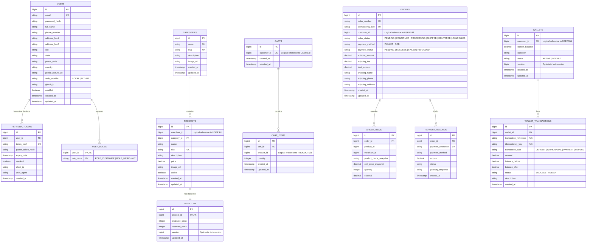

# Entity Relationships & Schema ERD

## 1. Comprehensive Entity Relationship Diagram

```mermaid
erDiagram
    %% Profile Service Domain
    USERS ||--o{ REFRESH_TOKENS : "has active sessions"
    USERS ||--o{ USER_ROLES : "assigned"
    
    USERS {
        bigint id PK
        string email UK
        string password_hash
        string full_name
        string phone_number
        string address_line1
        string address_line2
        string city
        string state
        string postal_code
        string country
        string profile_picture_url
        string auth_provider "LOCAL | GITHUB"
        string github_id
        boolean enabled
        timestamp created_at
        timestamp updated_at
    }

    USER_ROLES {
        bigint user_id PK,FK
        string role_name PK "ROLE_CUSTOMER | ROLE_MERCHANT"
    }

    REFRESH_TOKENS {
        bigint id PK
        bigint user_id FK
        string token_hash UK
        string parent_token_hash
        timestamp expiry_date
        boolean revoked
        string client_ip
        string user_agent
        timestamp created_at
    }

    %% Product Service Domain
    CATEGORIES ||--o{ PRODUCTS : "contains"
    PRODUCTS ||--|| INVENTORY : "has stock level"

    CATEGORIES {
        bigint id PK
        string name UK
        string slug UK
        string description
        string image_url
        timestamp created_at
        timestamp updated_at
    }

    PRODUCTS {
        bigint id PK
        bigint merchant_id "Logical reference to USERS.id"
        bigint category_id FK
        string name
        string sku UK
        string description
        decimal price
        string image_url
        boolean active
        timestamp created_at
        timestamp updated_at
    }

    INVENTORY {
        bigint id PK
        bigint product_id UK,FK
        integer available_stock
        integer reserved_stock
        bigint version "Optimistic lock version"
        timestamp updated_at
    }

    %% Cart Service Domain
    CARTS ||--o{ CART_ITEMS : "contains"

    CARTS {
        bigint id PK
        bigint customer_id UK "Logical reference to USERS.id"
        timestamp created_at
        timestamp updated_at
    }

    CART_ITEMS {
        bigint id PK
        bigint cart_id FK
        bigint product_id "Logical reference to PRODUCTS.id"
        integer quantity
        timestamp created_at
        timestamp updated_at
    }

    %% Order Service Domain
    ORDERS ||--o{ ORDER_ITEMS : "contains"
    ORDERS ||--o{ PAYMENT_RECORDS : "tracks"

    ORDERS {
        bigint id PK
        string order_number UK
        string idempotency_key UK
        bigint customer_id "Logical reference to USERS.id"
        string order_status "PENDING | CONFIRMED | PROCESSING | SHIPPED | DELIVERED | CANCELLED"
        string payment_method "WALLET | COD"
        string payment_status "PENDING | SUCCESS | FAILED | REFUNDED"
        decimal subtotal_amount
        decimal shipping_fee
        decimal total_amount
        string shipping_name
        string shipping_phone
        string shipping_address
        timestamp created_at
        timestamp updated_at
    }

    ORDER_ITEMS {
        bigint id PK
        bigint order_id FK
        bigint product_id
        bigint merchant_id
        string product_name_snapshot
        decimal unit_price_snapshot
        integer quantity
        decimal subtotal
    }

    PAYMENT_RECORDS {
        bigint id PK
        bigint order_id FK
        string payment_reference UK
        string payment_method
        decimal amount
        string status
        string gateway_response
        timestamp created_at
    }

    %% Wallet Service Domain
    WALLETS ||--o{ WALLET_TRANSACTIONS : "logs"

    WALLETS {
        bigint id PK
        bigint customer_id UK "Logical reference to USERS.id"
        decimal current_balance
        string currency
        string status "ACTIVE | LOCKED"
        bigint version "Optimistic lock version"
        timestamp created_at
        timestamp updated_at
    }

    WALLET_TRANSACTIONS {
        bigint id PK
        bigint wallet_id FK
        string transaction_reference UK
        string idempotency_key UK
        string transaction_type "DEPOSIT | WITHDRAWAL | PAYMENT | REFUND"
        decimal amount
        decimal balance_before
        decimal balance_after
        string status "SUCCESS | FAILED"
        string description
        timestamp created_at
    }
```

